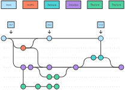

# Gitいろいろ

## 基本

https://git-scm.com/book/en/v2/Getting-Started-What-is-Git%3F

### Gitは何？

バーション管理ツール(VCS)の一つ、他もたくさんある。

### Repositoryとは？

プロジェクトダイレクトリーに隠れている`.git`フォルダー

### Stageとは（git add. など）

- `git add`
- `git add .`

### Commitは何？

- `git commit`
- `git commit -m　"feat: hogefuga"`
- `git commit --allow-empty -m "chore: trigger CI"`

### Branchとは？

- ``

### Mergeとは？

### Remoteは？

git remote

他のところにあるレポジトリ

### Push/Pullとは？

### Mergeとは？

### Rebaseとは？

https://docs.gitlab.com/ee/topics/git/git_rebase.html

## 応用編

### Cherry Pick

### Reset

### Blame

## よく使うコマンド

## コミットメッセージ規定

> 現在形で（「◯◯した」ではなく「◯◯する」）書くこととします

- Conventional Commits: https://www.conventionalcommits.org/en/v1.0.0/
- https://zenn.dev/itosho/articles/git-commit-message-2023

## Git運用・手法など

### GitFlow

https://www.atlassian.com/git/tutorials/comparing-workflows/gitflow-workflow

### GitHub Flow

### Stacked Diffs

https://newsletter.pragmaticengineer.com/p/stacked-diffs

## Gitソフトウエア

- Vscode + Gitlens + Gitgraph
- Fork
- Gitkraken
- ほかもいろいろ

## 最近流行ってる

- Graphite: https://graphite.dev/

## 関連リンク

- 規定いろいろ（日本語）：https://github.com/manabuyasuda/coding-guidelines/blob/master/html/html-guideline.md
- 

