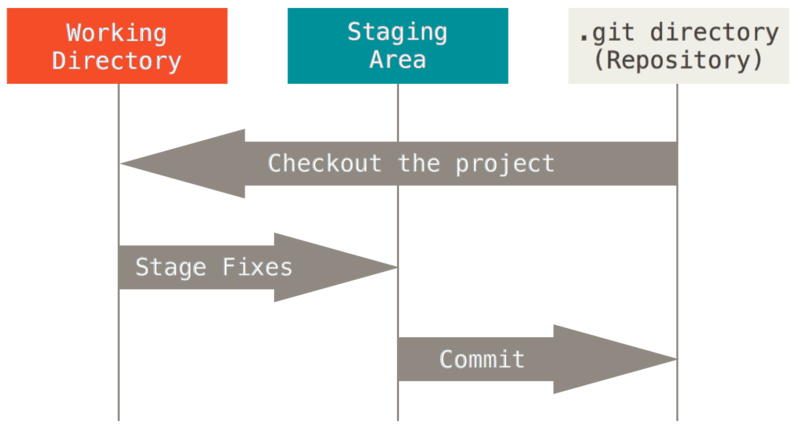

<!-- 
_header: ""
_footer: ""
_paginate: false
-->

# Gitのいろいろ

## 基礎知識

### Git

バーション管理ツール(VCS)の一つ、他もたくさんある。

https://git-scm.com/book/en/v2/Getting-Started-What-is-Git%3F

### Repository

プロジェクトダイレクトリーに隠れている`.git`ダイレクトリー

- `git init` 

### Stage

Gitにファイルを登録する

- `git add`
- `git add .`

https://stackoverflow.com/questions/3689838/whats-the-difference-between-head-working-tree-and-index-in-git

---

### Commit

- `git commit` - コミットする、テキストエディターを開く
- `git commit -m　"feat: hogefuga"` - コミットする :smile:
- `git commit --allow-empty -m "chore: trigger CI"` - 空のコミットを作る
:sparkles:- `git commit -a` - 全部のファイルをaddして同時ににコミットする。

### Branch

- `git branch` - ブランチ一覧
- `git branch -d <ブランチ名>` - ブランチを削除する
- `git switch <ブランチ名>` - ブランチを切り替え　<- Newらしい
- `git switch -c <新ブランチ名>` - ブランチを作成して、切り替えする。（`git checkout -b <新ブランチ名>`）

https://stackoverflow.com/questions/57265785/whats-the-difference-between-git-switch-and-git-checkout-branch

### Mergeとは？

ブランチを統合する

Fast Forward: https://dev.to/zdybit/learn-git-fast-forward-reproducing-github-pull-requests-in-practice-3b8g

---

https://www.biteinteractive.com/understanding-git-merge/

### Remoteは？

他のところにあるレポジトリ

- `git remote`
- `git remote add`
- `git remote remove`
- `git remote set-url`

### Push/Pullとは？

リモート同期する

## 応用編

### Reset

現在のブランチ（HEAD）を特定のコミットに移動する

### Revert

https://www.atlassian.com/git/tutorials/undoing-changes/git-revert

### Cherry Pick

あるコミットの内容を、現在のブランチに追加する。

### Rebase

https://docs.gitlab.com/ee/topics/git/git_rebase.html

### Blame

誰かこの行を書いたのを見れる

`git blame <ファイル名>`

（大体vscodeを見ている）

https://www.r-staffing.co.jp/engineer/entry/20200626_1

### 他のコマンド

- `git log`
- `git log --oneline`
- `git reflog`
- `git show`
- `git ls-tree`
- `git log --pretty=oneline --graph --decorate --all`

## コミットメッセージ規定

> 現在形で（「◯◯した」ではなく「◯◯する」）書くこととします

- Conventional Commits: https://www.conventionalcommits.org/en/v1.0.0/
- https://zenn.dev/itosho/articles/git-commit-message-2023

## Git運用・手法など

https://graphite.dev/guides/git-branching-strategies

### GitFlow

https://www.atlassian.com/git/tutorials/comparing-workflows/gitflow-workflow
https://docs.github.com/en/get-started/using-github/github-flow

### GitHub Flow

https://docs.github.com/en/get-started/using-github/github-flow

### Stacked Diffs

- （英語）https://newsletter.pragmaticengineer.com/p/stacked-diffs
- （日本語）https://engineering.mercari.com/blog/entry/20231209-git-branch-strategy-stacked-diffs-case-study/
- Graphite: https://graphite.dev/

## Gitソフトウエア

- Vscode + Gitlens + Gitgraph
- Fork
- Gitkraken
- ほかもいろいろ

## 関連リンク

- (日本語）：https://github.com/manabuyasuda/coding-guidelines/blob/master/html/html-guideline.md
- https://semver.org/

